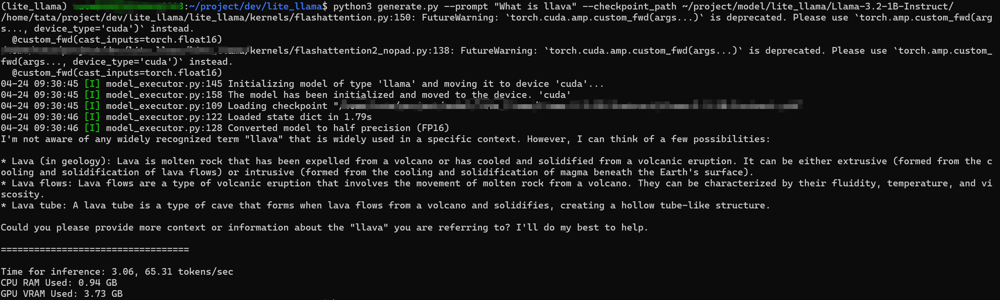

<div align="center">

# Litellama

**A light llama-like llm inference framework based on the triton kernel.**

[](https://github.com/harleyszhang/lite_llama/blob/main/README.md)
[](https://github.com/harleyszhang/lite_llama/blob/main/README.zh.md)


<pre>
         ✅ Flash attention      ✅ Reduce GPU memory (fp16/32)    ✅ Beginner friendly
</pre>

</div>

## Features

- Up to `4x` speedup over transformers, llama3 1B and 3B models.
- Supports the latest `llama3`, `Qwen2.5`, `Llava1.5` model inference, `top-p` sampling, streaming output.
- Supports GQA, ~~cuda graph optimization (with limitations)~~.
- Supports `flashattention1`, `flashattention2`, `flashdecoding` (supports `NopadAttention`).
- Support efficient dynamic management of kv cache (`auto tokenattnetion`).
- Support fusion of operators, e.g. fusion of `*` and `silu` for element-by-element multiplication, k v linear layer fusion, fusion of `skip` and `rmsnorm`.
- Some custom operators such as `rmsnorm`, `rope`, `softmax`, `element-by-element-multiplication`, etc. are implemented using the efficient `triton` kernel.

## Setup and Installation
 
### Pre-requisites
> If you don't have a physical server, you can try using [virtal cloud remote server](https://growthdata.virtaicloud.com/t/hK).

lite_llama framework requires the following dependencies:

For cuda, torch, and triton version

```bash
# nvcc -V
nvcc: NVIDIA (R) Cuda compiler driver
Copyright (c) 2005-2023 NVIDIA Corporation
Built on Mon_Apr__3_17:16:06_PDT_2023
Cuda compilation tools, release 12.1, V12.1.105
Build cuda_12.1.r12.1/compiler.32688072_0
# Python 3.11.8:
# pip list | grep torch
torch                          2.1.2
triton                         2.1.0
triton-nightly                 3.0.0.post20240716052845
```
For rocm, torch, and triton version:
```bash
# rocminfo | grep -i version
ROCk module version 6.10.5 is loaded
Runtime Version:         1.14
Runtime Ext Version:     1.6
# Python 3.11.8:
# pip list | grep torch
pytorch-triton-rocm 3.2.0
torch               2.6.0+rocm6.2.4
torchaudio          2.6.0+rocm6.2.4
torchvision         0.21.0+rocm6.2.4
```

## Getting Started

Recommended cuda version 12.0 and above. Download [llama3.2-1B-Instruct Model](https://pan.quark.cn/s/f476119babb3) and place it in the specified `checkpoints_dir` directory. `python apply_weight_convert.py` needs to be run to convert the hf model weights to `lite_llama` weight format, before running `cli.py`.

```bash
apt update
apt install imagemagick
conda create --name lite_llama python >= 3.11
conda activate lite_llama
git clone https://github.com/harleyszhang/lite_llama.git
cd lite_llama/
pip install -r requirement.txt
python test_weight_convert.py # model weight transformation
python generate.py --prompt "What is large language model" --checkpoint_path /path/to/model/Llama-3.2-1B-Instruct/ # Run on the basis that the model has been downloaded and placed in the specified directory
```

ROCm version 5.7 and above is recommended.

```bash
pip install matplotlib  
pip install pandas
pip3 install torch torchvision torchaudio --index-url https://download.pytorch.org/whl/rocm6.2.4

apt update
apt install imagemagick
conda create --name lite_llama python >= 3.11
conda activate lite_llama
git clone https://github.com/harleyszhang/lite_llama.git
cd lite_llama/
pip install -r requirement.txt
python test_weight_convert.py # model weight transformation
python generate.py --prompt "What is large language model" --checkpoint_path /path/to/model/Llama-3.2-1B-Instruct/ # Run on the basis that the model has been downloaded and placed in the specified directory
```


## Evaluation

After `cli.py` runs successfully, the terminal displays the interface as shown below, and you can enter your question in the terminal.


After `generate.py` runs successfully, the terminal displays the interface as shown below, and you can enter your question in the terminal.



After `cli_llava.py` runs successfully, the terminal displays the interface as shown below, enter your picture and prompt word in the terminal, and then enter.


For performance test, after changing your model weight path, run `lite_llama/examples/benchmark.py` file directly, it will output the latency and throughput performance comparison between lite_llama and transformers libraries, the result of the first run is not very accurate, so we suggest you to take the second run as a reference. For example, for the Llama-3.2-3B model with `prompt_len = 25`, `batch_size = 12`, and `max_gen_len = 1900`, the result of benchmark:
```bash
lite_llama inference time: 31.3463 s
Transformers inference time: 69.1433 s
lite_llama throughput: 730.45 tokens/s
Transformers throughput: 183.95 tokens/s
lite_llama per token latency: 1.369015 ms/token
Transformers per token latency: 5.436221 ms/token
```


## TODO
- [x] Optimized for decode phase using cuda graph
- [x] Use flashattention instead of standard attention
- [x] Upgrade `flashattention` to `flashattention2` to reduce some computation.
- [x] The decode phase of the reasoning uses `flashdecoding`
- [x] Support kv cache Efficient dynamic management
- [x] Use `GQA_KV_heads_index` instead of `repeat_kv` function
- [x] kv Linear layer fusion
- [x] Operator fusion: the skip operation on residual joins is fused with the `rmsnorm` operator to form a new `skip_rmsnorm` operator.
- [x] Refactoring and optimizing the `MHA` module to optimize the `context_attention` and `token_attention` kernels to support `Nopad attention` and `kv cache` dynamic allocation and management.
- [ ] Supports continuous batch optimization.
- [ ] Support for AWQ and SmoothQuant quantization.
- [ ] Code refactoring and fix for cuda graph not working properly after optimization with AutoTokenAttention.

Detailed information can be found in [performance optimization](docs/performance_optimization.md)


## Acknowledgement

- [meta-llama/llama-models](https://github.com/meta-llama/llama-models/tree/main)
- [transformers](https://github.com/huggingface/transformers)
- [Liger-Kernel](https://github.com/linkedin/Liger-Kernel/tree/main)
- [kernl](https://github.com/ELS-RD/kernl/tree/main)
- [unsloth](https://github.com/unslothai/unsloth/tree/main)
- [openai-triton](https://triton-lang.org/main/getting-started/tutorials/)
- [lightllm](https://github.com/ModelTC/lightllm)
- [vllm](https://github.com/vllm-project/vllm)


### Citation

If you use Litellama in your research, please cite the following work:

```bibtex
@misc{litellama-2023,
  author       = {Litellama AI team},
  title        = {Litellama},
  howpublished = {\url{https://github.com/harleyszhang/lite_llama}},
  year         = {2023},
}
```
